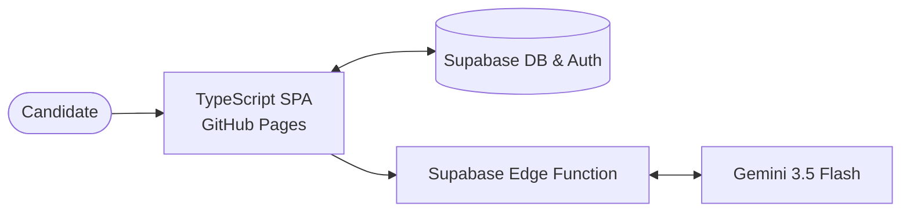

# InterviewAI 🧠

A sleek, premium, and AI-driven web application that generates hyper-realistic interview preparation plans and skill gap strategies. By matching a candidate's resume (PDF) against target job descriptions, the application uses **Gemini 3.5 Flash** to provide a brutally honest assessment, interactive question cards, and structured study roadmaps.

---

## 🗺️ Architecture Overview

The diagram below illustrates the end-to-end data flow from uploading the resume to displaying the personalized preparation plan:



---

## ✨ Features

- **🎯 Resume Match Score**: A strict, AI-driven assessment (0-100%) that measures match level. It penalizes lack of core frameworks, domain mismatches, or seniority gaps.
- **🔍 Skill Gaps Diagnostic**: Pinpoints exactly what frameworks, tools, or methodologies are missing, classifying them into **High**, **Medium**, or **Low** severity.
- **📈 Tailored Preparation Roadmap**:
  - **Match Score ≥ 30%**: Generates a day-by-day preparation schedule focused on target-role requirements.
  - **Match Score < 30%**: Triggers a **Reality Check & Pivot Strategy** with long-term foundational shifts.
- **💡 Dual-Track Question Cards**: Generates target-specific questions split into **Technical** and **Behavioral** tracks. Each question card details:
  - _Interviewer Intention_: Rationale and red flags.
  - _Model Answer_: Concrete, actionable bullet points and guidelines in the third person.
- **🔑 Google OAuth Integration**: Seamless and secure sign-in powered by Supabase Auth.
- **🕒 Interactive History Panel**: Slide-out drawer displaying past preparation strategies and match history.

---

## 🛠️ Technology Stack

| Component           | Technology                         | Description                                                              |
| :------------------ | :--------------------------------- | :----------------------------------------------------------------------- |
| **Frontend SPA**    | TypeScript, Tailwind CSS v4        | Compiled using `esbuild` for speed and modern styling.                   |
| **Backend API**     | Deno v2, Supabase Edge Functions   | Serverless functions for handling document upload and LLM requests.      |
| **Database & Auth** | Supabase (PostgreSQL), Go-True     | Relational storage for reports and history; Google OAuth authentication. |
| **AI Engine**       | Gemini 3.5 Flash (`@google/genai`) | Multimodal extraction and analysis directly from binary PDFs.            |
| **Deployment**      | GitHub Actions, GitHub Pages       | Continuous integration and automatic deployment of static assets.        |

---

## 📂 Project Structure

```
├── .github/workflows/   # GitHub Actions deployment pipelines
│   └── deploy.yml       # Production builds and deploys to GitHub Pages
├── dist/                # Production build output directory (git-ignored)
├── src/                 # Client-side source code
│   ├── index.css        # Base styling and design system tokens
│   └── main.ts          # Core SPA Router, state machine, and UI components
├── supabase/            # Supabase backend definitions
│   └── functions/       # Edge functions (e.g., generate-report)
├── deno.json            # Task configurations and dependencies
├── index.html           # Main entry document
└── server.ts            # Local development file server
```

---

## 💻 Local Development Setup

### 1. Prerequisites

Make sure you have [Deno v2](https://deno.land/) installed:

```bash
# macOS / Linux
curl -fsSL https://deno.land/install.sh | sh

# Windows (PowerShell)
irm https://deno.land/install.ps1 | iex
```

### 2. Configure Environment Variables

Create a `.env` file in the project root:

```ini
SUPABASE_URL="https://your-project-ref.supabase.co"
SUPABASE_ANON_KEY="your-supabase-anon-key"
GOOGLE_GENAI_API_KEY="your-gemini-api-key"
```

### 3. Start the Development Server

Run the local dev command, which watches for changes, runs tailwind/esbuild, and spins up Deno on port `3000`:

```bash
deno task dev
```

Open [http://localhost:3000](http://localhost:3000) in your web browser.

---

## 🗄️ Database Schema

The database table `reports` holds generated plans. Create the table in your Supabase SQL Editor:

```sql
create table reports (
  id uuid default gen_random_uuid() primary key,
  user_id uuid references auth.users(id) on delete cascade not null,
  title text not null,
  matchScore int not null,
  jobDescription text not null,
  technicalQuestions jsonb default '[]'::jsonb not null,
  behavioralQuestions jsonb default '[]'::jsonb not null,
  skillGaps jsonb default '[]'::jsonb not null,
  preparationPlan jsonb default '[]'::jsonb not null,
  createdAt timestamp with time zone default timezone('utc'::text, now()) not null
);

-- Enable Row Level Security (RLS)
alter table reports enable row level security;

-- Policy: Users can only see/edit their own reports
create policy "Users can manage their own reports"
  on reports for all
  using (auth.uid() = user_id);
```

---

## 🚀 Deployment

### Static Frontend (GitHub Pages)

The client application is built to deploy automatically to GitHub Pages via GitHub Actions:

1. Ensure your repository settings allow GitHub Actions deployment (under **Settings** -> **Pages**, select **GitHub Actions** as the source).
2. Push your changes to the `main` branch:
   ```bash
   git add .
   git commit -m "Configure production deployment"
   git push origin main
   ```
3. The build script automatically copies `index.html` into `./dist` and compiles assets into `./dist/assets`. Since assets are referenced relatively (e.g. `assets/index.css`), the project functions perfectly under repository sub-paths (like `/Interview-AI/`).

### Supabase Edge Functions (Dashboard Setup)

Since the database and backend are managed directly in the Supabase Dashboard without a local Supabase CLI setup, follow these steps:

1. **Create the Edge Function**:
   - Go to your **Supabase Dashboard** -> **Edge Functions** (the lightning icon on the sidebar).
   - Click **New Function** (or select the existing `generate-report` function).
   - Paste the code from [supabase/functions/generate-report/index.ts](file:///home/aditya/Downloads/Test-Project/supabase/functions/generate-report/index.ts) directly into the online editor.

2. **Add Gemini API Key Secret**:
   - In the **Supabase Dashboard**, navigate to **Settings** (gear icon) -> **Edge Functions**.
   - Under the **Secrets** section, click **Add Secret**.
   - Set the name to `GOOGLE_GENAI_API_KEY` and paste your Gemini API key as the value.
   - Save the secret.
