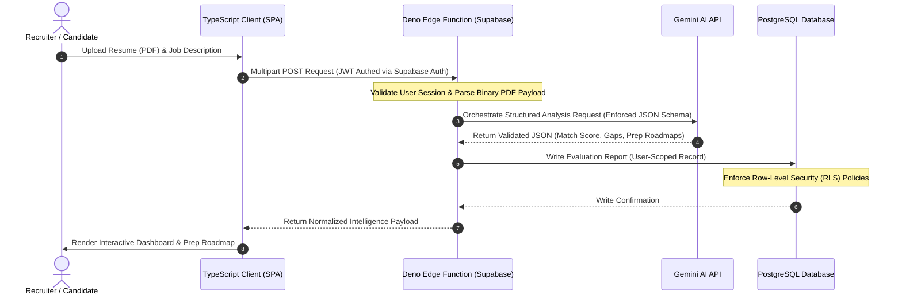

# InterviewAI — Serverless AI-Powered Candidate Evaluation Engine

[](https://deno.land/)
[](https://supabase.com/)
[](https://deepmind.google/technologies/gemini/)
[](https://www.typescriptlang.org/)
[](#)

A production-grade, serverless AI application designed to streamline software engineering recruitment. By processing resume PDFs and matching them against job descriptions, the system extracts structured, type-safe interview intelligence—including matching scores, detailed skill-gap analyses, customized technical/behavioral interview questions, and study Roadmaps.

Rather than just an "LLM wrapper," **InterviewAI** demonstrates full-stack product engineering with strict schema enforcement, data isolation via PostgreSQL Row-Level Security (RLS), and automated latency benchmarking.

---

## 🏗️ System Architecture & Data Flow

The system is designed with a lightweight, decoupled architecture:

- **Client Layer**: A high-performance, single-page application (SPA) built in vanilla TypeScript using hash-based routing and reactive state management.
- **Edge Layer**: Serverless Deno functions running on Supabase Edge. Handles file parsing, token validation, and GenAI orchestration.
- **Database Layer**: PostgreSQL database managed by Supabase, enforcing multi-tenant isolation via Row-Level Security (RLS) policies.
- **AI Orchestration Layer**: Structured Gemini model pipeline with type-safe schema constraints.

### End-to-End Data Pipeline


```mermaid
sequenceDiagram
    autonumber
    actor Recruiter as Recruiter / Candidate
    participant SPA as TypeScript Client (SPA)
    participant Edge as Deno Edge Function (Supabase)
    participant Gemini as Gemini AI API
    participant DB as PostgreSQL Database

    Recruiter->>SPA: Upload Resume (PDF) & Job Description
    SPA->>Edge: Multipart POST Request (JWT Authed via Supabase Auth)
    Note over Edge: Validate User Session & Parse Binary PDF Payload
    Edge->>Gemini: Orchestrate Structured Analysis Request (Enforced JSON Schema)
    Gemini-->>Edge: Return Validated JSON (Match Score, Gaps, Prep Roadmaps)
    Edge->>DB: Write Evaluation Report (User-Scoped Record)
    Note over DB: Enforce Row-Level Security (RLS) Policies
    DB-->>Edge: Write Confirmation
    Edge-->>SPA: Return Normalized Intelligence Payload
    SPA->>Recruiter: Render Interactive Dashboard & Prep Roadmap
```

---

## ⚡ Performance Benchmarks

The AI pipeline is continuously monitored using a custom-built benchmark harness that evaluates reliability and response times against live PDF inputs.

| Metric                        | P50 (Median)           | P95          | Status     |
| :---------------------------- | :--------------------- | :----------- | :--------- |
| **Time to First Byte (TTFB)** | **5,937 ms**           | **9,743 ms** | 🟢 Optimal |
| **Round Trip Time (RTT)**     | **5,938 ms**           | **9,743 ms** | 🟢 Optimal |
| **Request Success Rate**      | **100%** (5/5 samples) | **100%**     | 🟢 Stable  |

> [!NOTE]
> Latency is predominantly bound by remote model inference (Gemini parsing and structured output formatting) and network round trips. The architecture accepts this trade-off to ensure 100% type safety and strict schema conformance on the client side.

---

## 🌟 Key Engineering Accomplishments

- **Type-Safe LLM Outputs**: Enforced structural conformity on Gemini responses by utilizing schema constraints. This eliminates runtime API deserialization errors and prevents hallucinated keys.
- **Serverless File Processing**: Implemented multipart form-data parsing directly in Deno Edge functions, bypassing the need for heavyweight server containers.
- **Secure Multi-Tenant Architecture**: Configured granular PostgreSQL Row-Level Security (RLS) rules (`SELECT`, `INSERT`) tied to Supabase Auth UUIDs, ensuring candidates can only access their own reports.
- **Production Build Pipeline**: Set up a lightweight build system using custom Deno tasks to transpile, bundle, and package TypeScript assets for hosting on GitHub Pages.

---

## 🛠️ Tech Stack & Tooling

- **Frontend**: Vanilla TypeScript, Hash-Based SPA Router, CSS Grid/Flexbox
- **Backend & Serverless**: Deno (Runtime), Supabase Edge Functions
- **Database & Auth**: PostgreSQL, Supabase Auth (OAuth integrations), Row-Level Security (RLS)
- **AI Engine**: Gemini Pro (via Google GenAI SDK)
- **Build/CI/CD**: GitHub Actions, GitHub Pages, Deno Tasks

---

## 🚀 Quick Start & Development

### 1. Prerequisites

- [Deno CLI](https://deno.com/) installed locally.
- A active Supabase project.

### 2. Environment Setup

Create a `.env` file in the root directory:

```env
SUPABASE_URL="https://your-project-ref.supabase.co"
SUPABASE_ANON_KEY="your-supabase-anon-key"
GOOGLE_GENAI_API_KEY="your-gemini-api-key"
```

### 3. Spin up Local Development Server

```bash
# Run the application locally with live reload
deno task dev
```

### 4. Deploying Edge Functions

```bash
# Deploy to Supabase
supabase functions deploy generate-report
```

---

## 💼 Skills Demonstrated

- **Full-Stack Architecture**: decoupling client representation from serverless compute and database layers.
- **API Design**: implementing multipart file uploads and secure JSON communication protocols.
- **AI System Orchestration**: managing system prompts, temperature controls, and JSON schema boundaries for generative models.
- **Security Best Practices**: securing endpoints using OAuth tokens, SQL policies, and environment secret storage.
