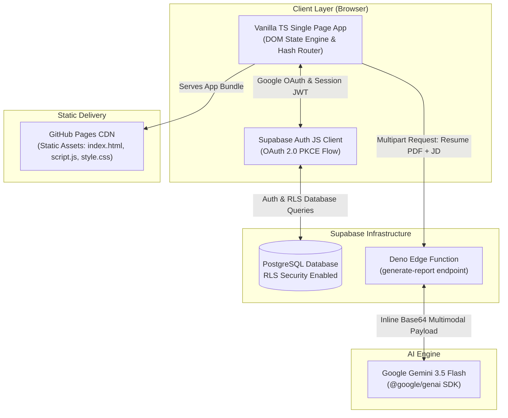

# InterviewAI 🧠

A production-grade, serverless AI web application designed to evaluate software engineering candidates by cross-analyzing resume PDFs against target job descriptions. Leveraging **Gemini 2.5 Flash** structured outputs, Deno v2, Supabase Auth (OAuth 2.0), PostgreSQL, and a tailored build system, InterviewAI delivers match scoring, severity-classified skill gaps diagnostic, targeted technical/behavioral interview question cards, and day-by-day prep roadmaps.

---

## 🗺️ System Architecture


```mermaid
graph TD
    subgraph Client ["Client Layer (Browser)"]
        SPA["Vanilla TS Single Page App<br/>(DOM State Engine & Hash Router)"]
        AuthSDK["Supabase Auth JS Client<br/>(OAuth 2.0 PKCE Flow)"]
    end

    subgraph CDN ["Static Delivery"]
        GHPages["GitHub Pages CDN<br/>(Static Assets: index.html, script.js, style.css)"]
    end

    subgraph Backend ["Supabase Infrastructure"]
        DB[(PostgreSQL Database<br/>RLS Security Enabled)]
        EdgeFunc["Deno Edge Function<br/>(generate-report endpoint)"]
    end

    subgraph AI ["AI Engine"]
        Gemini["Google Gemini 3.5 Flash<br/>(@google/genai SDK)"]
    end

    SPA -->|Serves App Bundle| GHPages
    SPA <-->|Google OAuth & Session JWT| AuthSDK
    AuthSDK <-->|Auth & RLS Database Queries| DB
    SPA -->|Multipart Request: Resume PDF + JD| EdgeFunc
    EdgeFunc <-->|Inline Base64 Multimodal Payload| Gemini
```

---

## 🛠️ Technology Stack & System Specifications

| Component                  | Technology                                | Technical Details                                                                                                                                              |
| :------------------------- | :---------------------------------------- | :------------------------------------------------------------------------------------------------------------------------------------------------------------- |
| **Frontend Architecture**  | TypeScript, Vanilla DOM, Tailwind CSS v4  | Lightweight single-page architecture (SPA) with Hash Routing (`#/`, `#/login`, `#/interview/:id`), event delegation, and single-source-of-truth state machine. |
| **Asset Compiler**         | `esbuild`, `build.ts`, `@tailwindcss/cli` | Custom Deno build runner (`build.ts`) executing `npm:esbuild` with compile-time environment variable injection (`SUPABASE_URL`, `SUPABASE_ANON_KEY`).          |
| **Runtime & Tooling**      | Deno v2.x                                 | Native TypeScript execution engine for dev server, asset bundling, task runner, and linting.                                                                   |
| **Backend & Serverless**   | Supabase Edge Functions (Deno runtime)    | Stateless serverless endpoint handling `multipart/form-data` uploads, document buffer extraction, and LLM orchestration.                                       |
| **Database & Auth**        | PostgreSQL 15+, Supabase Auth (GoTrue)    | Relational database with Row Level Security (RLS) policies, JSONB document storage, and Google OAuth 2.0 integration.                                          |
| **AI Engine & Multimodal** | Gemini 3.5 Flash (`@google/genai` v2)     | Inline Base64 PDF parsing with strictly enforced JSON Schema (`REPORT_SCHEMA`) and system instruction logic gates.                                             |
| **CI/CD & Hosting**        | GitHub Actions, GitHub Pages              | Decoupled build & deployment pipeline with GitHub Secrets injection and static asset artifact packaging.                                                       |

---

## 📂 Repository Layout

```
InterviewAI/
├── .github/
│   └── workflows/
│       └── deploy.yml            # GitHub Actions production deployment pipeline
├── dist/                         # Compiled static assets (Git-ignored)
│   ├── index.html                # Entry HTML document
│   ├── logo.jpg                  # Application branding asset
│   ├── script.js                 # Bundled ESM client application (esbuild output)
│   └── style.css                 # Compiled CSS bundle (Tailwind CLI output)
├── public/                       # Static public assets
│   ├── index.html                # Source HTML document template
│   └── logo.jpg                  # Static logo image
├── src/                          # Client-side source code
│   ├── index.css                 # CSS entry point with Tailwind theme tokens
│   └── script.ts                 # SPA router, state machine, Auth handlers & UI engine
├── supabase/                     # Database & Edge Function definitions
│   ├── functions/
│   │   └── generate-report/
│   │       └── index.ts          # Edge function handling Gemini multimodal analysis
│   └── setup.sql                 # Database table schema, indexes, and RLS policies
├── .env                          # Local environment variables (Git-ignored)
├── .gitignore                    # Git tracking exclusion rules
├── build.ts                      # Custom Deno bundling script for esbuild env injection
├── deno.json                     # Task runner scripts, compiler options & import maps
├── deno.lock                     # Lockfile for Deno and npm module dependencies
├── README.md                     # Project documentation
└── server.ts                     # Local development static file server
```

---

## ⚙️ Data Flow & Payload Specs

### Edge Function API Contract (`POST /functions/v1/generate-report`)

- **Content-Type**: `multipart/form-data`
- **Form Parameters**:
  - `resume`: Binary File (`application/pdf`, max size 3 MB)
  - `jobDescription`: String (raw job posting details)
- **Response Header**: `Content-Type: application/json`, `Access-Control-Allow-Origin: *`
- **Response Payload Schema**:

```json
{
  "report": {
    "matchScore": 85,
    "title": "Senior Frontend Engineer",
    "technicalQuestions": [
      {
        "question": "Given your experience with React, how would you approach state management in a micro-frontend setup?",
        "intention": "Evaluates architectural scalability and isolation boundaries.",
        "answer": "Discuss event bus patterns, custom element properties, or shared state stores with clear ownership."
      }
    ],
    "behavioralQuestions": [ ... ],
    "skillGaps": [
      { "skill": "GraphQL", "severity": "medium" }
    ],
    "preparationPlan": [
      {
        "day": 1,
        "focus": "System Architecture & State Management",
        "tasks": ["Review state synchronization patterns", "Build sample event bus"]
      }
    ]
  }
}
```

---

## 🗄️ Database Schema & RLS Security

Run the following DDL statements in your **Supabase SQL Editor** to establish the `public.reports` schema:

```sql
-- 1. Create reports table
create table if not exists public.reports (
  id uuid default gen_random_uuid() primary key,
  user_id uuid references auth.users(id) on delete cascade not null,
  title text not null,
  "jobDescription" text not null,
  "matchScore" integer not null,
  "technicalQuestions" jsonb default '[]'::jsonb,
  "behavioralQuestions" jsonb default '[]'::jsonb,
  "skillGaps" jsonb default '[]'::jsonb,
  "preparationPlan" jsonb default '[]'::jsonb,
  "createdAt" timestamp with time zone default timezone('utc'::text, now()) not null
);

-- 2. Create index on foreign key for query performance
create index if not exists idx_reports_user_id on public.reports(user_id);

-- 3. Enable Row Level Security (RLS)
alter table public.reports enable row level security;

-- 4. RLS Policy: Select permission bound to authenticated owner
create policy "Users can read own reports"
  on public.reports for select
  using (auth.uid() = user_id);

-- 5. RLS Policy: Insert permission bound to authenticated owner
create policy "Users can insert own reports"
  on public.reports for insert
  with check (auth.uid() = user_id);
```

---

## 💻 Local Development Setup

### 1. Prerequisites

Ensure [Deno v2](https://deno.land/) is installed:

```bash
# macOS / Linux
curl -fsSL https://deno.land/install.sh | sh

# Windows (PowerShell)
irm https://deno.land/install.ps1 | iex
```

### 2. Configure Environment Variables

Create a `.env` file in the project root directory:

```ini
SUPABASE_URL="https://your-project-ref.supabase.co"
SUPABASE_ANON_KEY="your-supabase-anon-key"
GOOGLE_GENAI_API_KEY="your-gemini-api-key"
```

### 3. Start Development Server

Run the development task, which compiles CSS with Tailwind CLI, builds ESM bundles with `build.ts`, and launches the Deno static HTTP server on port `3000`:

```bash
deno task dev
```

Navigate to `http://localhost:3000` in your web browser.

---

## 🚀 Production Deployment

### 1. GitHub Pages (Static Client)

1. **Configure Repository Secrets**:
   - In GitHub, go to **Settings** -> **Secrets and variables** -> **Actions**.
   - Add Secret: `SUPABASE_URL` = `https://<ref>.supabase.co`
   - Add Secret: `SUPABASE_ANON_KEY` = `<your-supabase-anon-key>`

2. **Configure Supabase OAuth Redirect URLs**:
   - Under **Supabase Dashboard** -> **Authentication** -> **URL Configuration**, add your production GitHub Pages URL:
     `https://<username>.github.io/<repository-name>/`

3. **Deploy**:
   - Push changes to the `main` branch. `.github/workflows/deploy.yml` will compile production assets via `build.ts` and deploy to GitHub Pages automatically.

### 2. Supabase Edge Functions (Backend)

1. Deploy `supabase/functions/generate-report/index.ts` to your Supabase project using the Supabase CLI or Dashboard.
2. In **Supabase Dashboard** -> **Settings** -> **Edge Functions**, set the secret:
   - `GOOGLE_GENAI_API_KEY` = `<your-gemini-api-key>`
